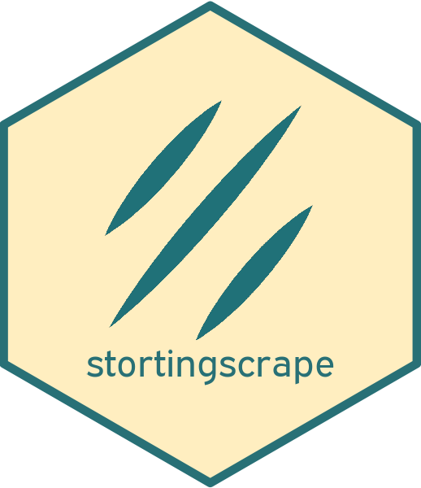

# stortingscrape 

<!-- badges: start -->

[](https://cran.r-project.org/package=stortingscrape)
[](https://github.com/martigso/stortingscrape)
[](https://cran.r-project.org/package=stortingscrape)
[](https://cran.r-project.org/package=stortingscrape)
[](https://github.com/martigso/stortingscrape/actions/workflows/check-standard.yaml)
<!-- badges: end -->

`stortingscrape` is an R package for retrieving data from the Norwegian
parliament (*Stortinget*) through their easily accessible back-end API.
The data requested using the package require little to no further
structuring. The scope of the package ranges from general data on the
parliament itself (rules, session info, committees, etc) to data on the
parties, bibliographies of the MPs, questions, hearings, debates, votes,
and more.

The main goal of `stortingscrape` is to allow researchers to access any
data from the Norwegian parliament easily, but also still be able to
structure the data according to ones need. Most importantly, the package
is facilitated for weaving together different parts of the
data.stortinget.no API.

## Installation

The package can be installed either by cloning this repository and
building the package in R or by installing via the
`devtools::install_github()` function:

``` r
devtools::install_github("martigso/stortingscrape")
library(stortingscrape)
```

## Usage example

Request all interpellations for a parliamentary session:

``` r
sessions <- get_parlsessions()
qsesh <- get_session_questions(sessions$id[9], q_type = "interpellasjoner")

library(pbmcapply) # for progress bar. never use paralell on scraping

int1213 <- pbmclapply(qsesh$id, function(x){

  get_question(x, good_manners = 2)

}, mc.cores = 1) # do not increase number of cores!

int1213 <- do.call(rbind, int1213)
```

Get biographies of all MPs for a given parliamentary period (will take
\~30min to run):

``` r
parl_periods <- get_parlperiods()

mps <- get_parlperiod_mps(parl_periods$id[1], substitute = TRUE)

mps_bios <- pbmclapply(mps$id, function(x) get_mp_bio(x, good_manners = 2), mc.cores = 1) # do not increase number of cores!

# Expand by all periods the MP has been in parliament
mps_periods <- lapply(mps_bios, function(x){
  
  data.frame(x$root,
             x$parl_periods)

})

mps_periods <- do.call(rbind, mps_periods)

# Expand by all positions held in parliament
mps_positions <- lapply(mps_bios, function(x){
  
  if(nrow(x$parl_positions) < 1) return()
  
  data.frame(x$root,
             x$parl_positions)
  
})

mps_positions <- do.call(rbind, mps_positions)
```

## Data description

The data is described in detail in the [API of
Stortinget](https://data.stortinget.no/dokumentasjon-og-hjelp/). The
package will implement English translations of this documentation in the
future.

## List of functions currently implemented

[You can find a list of all functions
here.](https://martigso.github.io/stortingscrape/functions.html)
